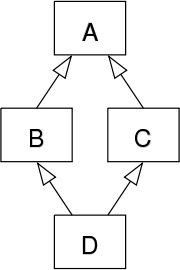
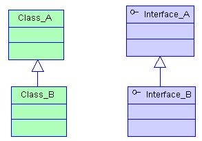
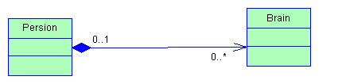

# 面向对象与面向过程

## 什么是面向过程

面向过程(Procedure Oriented)是一种以过程为中心的编程思想，是一种自顶而下的编程模式。最典型的面向过程的编程语言就是C语言。

简单来说，面向过程的开发范式中，程序员须要把问题分解成一个一个步骤，每个步骤用函数实现，一次调用即可。

就是说，在进行面向过程编程的时候，不需要考虑那么多，上来先定义一个函数，然后使用各种诸如if-else、for-each等方式进行代码执行。

面向过程进行的软件开发，其代码都是流程化的，很明确的可以看出第一步做什么、第二步做什么。这种方式的代码执行起来效率很高。

但是，面向过程同时存在着代码重用性低，扩展能力差，后期维护难度比较大等问题。

## 什么是面向对象

面向对象（Object Oriented）的雏形，最早在出现在1960年的Simula语言中，当时的程序设计领域正面临着一种危机：在软硬件环境逐渐复杂的情况下，软件如何得到良好的维护？

面向对象程序设计在某种程度上通过强调可重复性解决了这一问题。目前较为流行的面向对象语言主要有Java、C#、C++、Python、Ruby、PHP等。

简单来说，面向对象的开发范式中，程序员将问题分解成一个一个步骤，对每个步骤进行相应的抽象，形成对象，通过不同对象之间的调用，组合解决问题。

就是说，在进行面向对象进行编程的时候，要把属性、行为等封装成对象，然后基于这些对象及对象的能力进行业务逻辑的实现。比如:想要造一辆车，上来要先把车的各种属性定义出来，然后抽象成一个Car类。

面向对象的编程方法之所以更加受欢迎，是因为他更加符合人类的思维方式。这种方式编写出来的代码扩展性、可维护性都很高。

与其实面向对象是一种开发范式，倒不如说面向对象是一种对现实世界的理解和抽象的方法。通过对现实世界的理解和抽象，在运用封装、继承、多态等方法，通过抽象出对象的方式进行软件开发。

什么是封装、继承、多态？具体如何运营面向对象的方式编写代码呢？接下来我们介绍下面向对象具有三大基本特征和五大基本原则。

# 封装 继承 多态

## 什么是多态

多态（Polymorphism）,指为不同数据类型的实体提供统一的接口，或使用一个单一的符号来表示多个不同的类型。一般情况下，可以把多态分成以下几类：

* 特设多态：为个体的特定类型的任意集合定义一个共同接口。
* 参数多态：制定一个或多个类型补考名字而是靠可以表示任何类型的抽象符号
* 子类型：一个名字指称很多不同的类的实例，这些类有某个共同的超类。

### 特设多态
特设多态是程序设计语言的一种多态，多态函数有多个不同的实现，依赖于其实参而调用相应版本的函数。

### 参数多态

参数多态在程序设计语言与类型论中是指声明与定义函数、复合类型、变量时不指定其具体的类型，而把这部分类型作为参数使用，使得该定义对各种具体类型都适用。

参数多态其实也有很广泛的应用，比如Java中的泛型就是参数多态的一种。参数多态另外一个应用比较广泛的地方就是函数式编程。

### 子类型
在面向对象程序设计中，计算机程序运行时，相同的消息可能会送给多个不同的类别之对象，而系统可依据对象所属类别，引发对应类别的方法，而有不同的行为。

# 方法重写与重载

重载（Overloading）和重写（Overriding）是Java中两个比较重要的概念。

## 定义

重载：指的是在同一个类中，多个函数或者方法有同样的名称，但是参数列表不相同的情形，这样的同名不同参数的函数或者方法之间，互相称之为重载函数或者方法。

重写：指的是在Java的子类与父类中有两个名称、参数列表都相同的方法的情况。由于他们具有相同的方法签名，所以子类中的新方法将覆盖父类中原有的方法。

## 重载的例子
```
class Dog{
    public void bark(){
        System.out.println("woof ");
    }

    //overloading method
    public void bark(int num){
        for(int i=0; i<num; i++)
            System.out.println("woof ");
    }
}

```
上面的代码中，定义了两个bark方法，一个是没有参数的bark方法，另外一个是包含一个int类型参数的bark方法。我们就可以说这两个方法是重载方法，因为他们的方法名相同，参数列表不同。

在编译期，编译期可以根据方法签名（方法名和参数情况）情况确定具体哪个bark方法被调用。

方法重载的条件需要具备以下条件和要求：

1、被重载的方法必须改变参数列表； 2、被重载的方法可以改变返回类型； 3、被重载的方法可以改变访问修饰符； 4、被重载的方法可以声明新的或更广的检查异常； 5、方法能够在同一个类中或者在一个子类中被重载。

## 重写
```
class Dog{
    public void bark(){
        System.out.println("woof ");
    }
}
class Hound extends Dog{
    public void sniff(){
        System.out.println("sniff ");
    }

    public void bark(){
        System.out.println("bowl");
    }
}

public class OverridingTest{
    public static void main(String [] args){
        Dog dog = new Hound();
        dog.bark();
    }
}
// print bowl
```
上面的例子中，我们分别在父类、子类中都定义了bark方法，并且他们都是无参方法，所以我们就说这种情况就是方法重写。即子类Hound重写了父类Gog中的bark方法。

在测试的main方法中，dog对象被定义为Dog类型。

在编译期，编译器会检查Dog类中是否有可访问的bark()方法，只要其中包含bark（）方法，那么就可以编译通过。

在运行期，Hound对象被new出来，并赋值给dog变量，这时，JVM是明确的知道dog变量指向的其实是Hound对象的引用。所以，当dog调用bark()方法的时候，就会调用Hound类中定义的bark（）方法。这就是所谓的动态多态性。

方法重写的条件需要具备以下条件和要求：

1、参数列表必须完全与被重写方法的相同； 2、返回类型必须完全与被重写方法的返回类型相同； 3、访问级别的限制性一定不能比被重写方法的强； 4、访问级别的限制性可以比被重写方法的弱； 5、重写方法一定不能抛出新的检查异常或比被重写的方法声明的检查异常更广泛的检查异常 6、重写的方法能够抛出更少或更有限的异常（也就是说，被重写的方法声明了异常，但重写的方法可以什么也不声明） 7、不能重写被标示为final的方法； 8、如果不能继承一个方法，则不能重写这个方法。

## Java的继承和实现

前面的章节我们提到过面向对象有三个特征：封装、继承、多态。前面我们分别介绍过了这三个特性。

我们知道，继承可以使用现有类的所有功能，并在无需重新编写原来的类的情况下对这些功能进行扩展。这种派生方式体现了传递性。

在Java中，除了继承，还有一种体现传递性的方式叫做实现。那么，这两者方式有什么区别呢？

继承和实现两者的明确定义和区别如下：

继承（Inheritance）：如果多个类的某个部分的功能相同，那么可以抽象出一个类出来，把他们的相同部分都放到父类里，让他们都继承这个类。

实现（Implement）：如果多个类处理的目标是一样的，但是处理的方法方式不同，那么就定义一个接口，也就是一个标准，让他们的实现这个接口，各自实现自己具体的处理方法来处理那个目标

继承指的是一个类（称为子类、子接口）继承另外的一个类（称为父类、父接口）的功能，并可以增加它自己的新功能的能力。所以，继承的根本原因是因为要复用，而实现的根本原因是需要定义一个标准。

在Java中，继承使用extends关键字实现，而实现通过implements关键字。

> 简单点说，就是同样是一台汽车，既可以是电动车，也可以是汽油车，也可以是油电混合的，只要实现不同的标准就行了，但是一台车只能属于一个品牌，一个厂商。

```
class Car extends Benz implements GasolineCar, ElectroCar{

}

```

以上，我们定义了一辆汽车，他实现了电动车和汽油车两个标准，但是他属于奔驰这个品牌。像上面这样定义，我们可以最大程度的遵守标准，并且复用奔驰车所有已有的一些功能组件。

另外，在接口中只能定义全局常量（static final）和无实现的方法（Java 8以后可以有default方法）；而在继承中可以定义属性方法，变量，常量等。

特别需要注意的是，Java中支持一个类同时实现多个接口，但是不支持同时继承多个类。

## Java 不支持多继承
前面我们提到过："Java中支持一个类同时实现多个接口，但是不支持同时继承多个类。但是这个问题在Java 8之后也不绝对了。"

那么，是不是又很很想知道，为什么Java中不支持同时继承多个类呢？

### 多继承
一个类，只有一个父类的情况，我们叫做单继承。而一个类，同时有多个父类的情况，叫做多继承。

在Java中，一个类，只能通过extends关键字继承一个类，不允许多继承。但是，多继承在其他的面向对象语言中是有可能支持的。

像C++就是支持多继承的，主要是因为编程的过程是对现实世界的一种抽象，而现实世界中，确实存在着需要多继承的情况。比如维基百科中关于多继承举了一个例子：

例如，可以创造一个“哺乳类动物”类别，拥有进食、繁殖等的功能；然后定义一个子类型“猫”，它可以从父类继承上述功能。

但是，"猫"还可以作为"宠物"的子类，拥有一些宠物独有的能力。

所以，有些面向对象语言是支持多重继承的。

但是，多年以来，多重继承一直都是一个敏感的话题，反对者指它增加了程序的复杂性与含糊性。

### 菱形继承问题

假设我们有类B和类C，它们都继承了相同的类A。另外我们还有类D，类D通过多重继承机制继承了类B和类C。



这时候，因为D同时继承了B和C，并且B和C又同时继承了A，那么，D中就会因为多重继承，继承到两份来自A中的属性和方法。

这时候，在使用D的时候，如果想要调用一个定义在A中的方法时，就会出现歧义。

因为这样的继承关系的形状类似于菱形，因此这个问题被形象地称为菱形继承问题。

而C++为了解决菱形继承问题，又引入了虚继承。

因为支持多继承，引入了菱形继承问题，又因为要解决菱形继承问题，引入了虚继承。而经过分析，人们发现我们其实真正想要使用多继承的情况并不多。

所以，在 Java 中，不允许“实现多继承”，即一个类不允许继承多个父类。但是 Java 允许“声明多继承”，即一个类可以实现多个接口，一个接口也可以继承多个父接口。由于接口只允许有方法声明而不允许有方法实现（Java 8以前），这就避免了 C++ 中多继承的歧义问题。

但是，Java不支持多继承，在Java 8中支持了默认函数（default method ）之后就不那么绝对了。

# Java 的继承与组合
## 面向对象的复用技术
复用性是面向对象技术带来的很棒的潜在好处之一。如果运用的好的话可以帮助我们节省很多开发时间，提升开发效率。但是，如果被滥用那么就可能产生很多难以维护的代码。

作为一门面向对象开发的语言，代码复用是Java引人注意的功能之一。Java代码的复用有继承，组合以及代理三种具体的表现形式。本文将重点介绍继承复用和组合复用。

### 继承

继承是类与类或者接口与接口之间最常见的一种关系；继承是一种is-a关系。

> is-a：表示"是一个"的关系，如狗是一个动物



### 组合

组合(Composition)体现的是整体与部分、拥有的关系，即has-a的关系。

> has-a：表示"有一个"的关系，如狗有一个尾巴



### 组合与继承的区别和联系

> 在继承结构中，父类的内部细节对于子类是可见的。所以我们通常也可以说通过继承的代码复用是一种白盒式代码复用。（如果基类的实现发生改变，那么派生类的实现也将随之改变。这样就导致了子类行为的不可预知性；）
> 组合是通过对现有的对象进行拼装（组合）产生新的、更复杂的功能。因为在对象之间，各自的内部细节是不可见的，所以我们也说这种方式的代码复用是黑盒式代码复用。（因为组合中一般都定义一个类型，所以在编译期根本不知道具体会调用哪个实现类的方法）
> 继承，在写代码的时候就要指名具体继承哪个类，所以，在编译期就确定了关系。（从基类继承来的实现是无法在运行期动态改变的，因此降低了应用的灵活性。）
> 组合，在写代码的时候可以采用面向接口编程。所以，类的组合关系一般在运行期确定。

### 优缺点对比
组 合 关 系	继 承 关 系
优点：不破坏封装，整体类与局部类之间松耦合，彼此相对独立	缺点：破坏封装，子类与父类之间紧密耦合，子类依赖于父类的实现，子类缺乏独立性
优点：具有较好的可扩展性	缺点：支持扩展，但是往往以增加系统结构的复杂度为代价
优点：支持动态组合。在运行时，整体对象可以选择不同类型的局部对象	缺点：不支持动态继承。在运行时，子类无法选择不同的父类
优点：整体类可以对局部类进行包装，封装局部类的接口，提供新的接口	缺点：子类不能改变父类的接口
缺点：整体类不能自动获得和局部类同样的接口	优点：子类能自动继承父类的接口
缺点：创建整体类的对象时，需要创建所有局部类的对象	优点：创建子类的对象时，无须创建父类的对象


